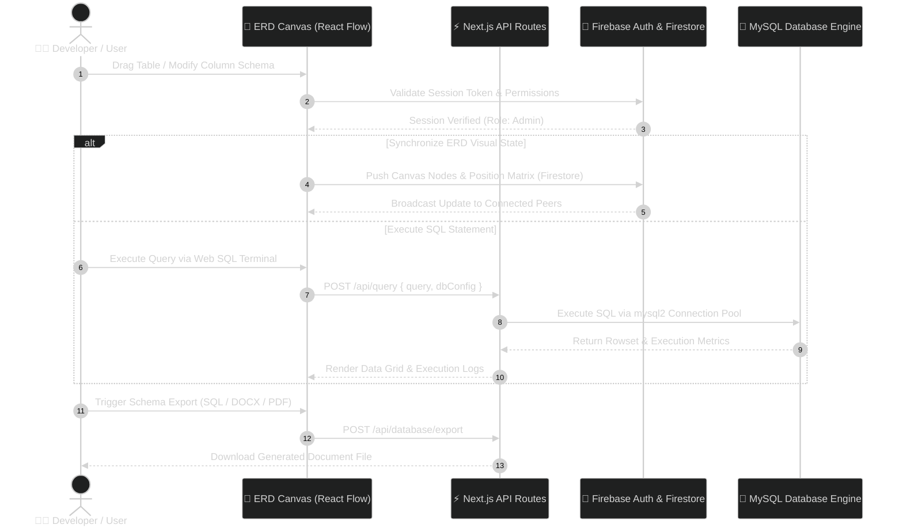

<div align="center">

<!-- Animated Header Banner -->


<br/>

<!-- Animated SVG Typing Banner -->
<a href="https://github.com/yourusername/schema-view">
  
</a>

<br/><br/>

<!-- Shields.io Badges -->
[](https://nextjs.org/)
[](https://react.dev/)
[](https://www.typescriptlang.org/)
[](https://tailwindcss.com/)
[](https://firebase.google.com/)
[](https://www.mysql.com/)
[](https://www.docker.com/)
[](https://github.com/yourusername/schema-view/actions)
[](LICENSE)

<br/>

**Schema View** is a state-of-the-art web application designed to bridge the gap between visual database modeling and real-time SQL management. Engineered with Next.js 16, React 19, and React Flow, it empowers engineers, database architects, and teams to build, inspect, and manage relational database schemas without friction.

[Explore Features](#-feature-showcase) • [Architecture](#-system-architecture) • [Performance Metrics](#-performance--analytics) • [Quickstart](#-quickstart-guide) • [API Reference](#-api-reference)

</div>

<!-- Animated Gradient Wave Divider -->


## 🌟 Feature Showcase

<table width="100%">
  <tr>
    <td width="50%" valign="top">
      <h3 style="color:#059669;">🎨 Visual ERD & Schema Canvas</h3>
      <ul>
        <li><b>Drag-and-Drop Node Graph:</b> Infinite interactive canvas powered by React Flow with custom node rendering.</li>
        <li><b>Smart Auto-Relationship Detection:</b> Automatically visualizes <code>1:1</code>, <code>1:N</code>, and <code>N:M</code> foreign key constraints.</li>
        <li><b>Rich Column Customization:</b> Define Primary Keys, Foreign Keys, <code>NOT NULL</code>, <code>UNIQUE</code>, auto-increments, and custom defaults visually.</li>
        <li><b>Color-Coded Entities:</b> Organize tables into domain clusters using custom inline palette themes.</li>
      </ul>
    </td>
    <td width="50%" valign="top">
      <h3 style="color:#7C3AED;">💻 Interactive Web SQL Terminal</h3>
      <ul>
        <li><b>Integrated Execution Engine:</b> Execute raw MySQL queries directly within the browser UI with zero overhead.</li>
        <li><b>Syntax Highlighting & Autocomplete:</b> Full SQL keyword formatting, autocomplete hints, and error diagnostics.</li>
        <li><b>Query Execution History:</b> Keep track of previous SQL executions with execution timestamps and row metrics.</li>
        <li><b>Granular Permissions:</b> Support for read-only preview modes and full read-write developer consoles.</li>
      </ul>
    </td>
  </tr>
  <tr>
    <td width="50%" valign="top">
      <h3 style="color:#2563EB;">📺 Fullscreen Presentation Mode</h3>
      <ul>
        <li><b>Distraction-Free Canvas:</b> Toggle immersive full-screen view tailored for architecture reviews and tech talks.</li>
        <li><b>Theme Customization:</b> Seamless switching between modern Dark mode glassmorphism and ultra-clean Light themes.</li>
        <li><b>Pan & Zoom Controls:</b> Smooth navigation shortcuts for large-scale enterprise database schemas (100+ tables).</li>
        <li><b>Interactive Node Focusing:</b> Click any table to isolate its relational tree and highlight connected foreign keys.</li>
      </ul>
    </td>
    <td width="50%" valign="top">
      <h3 style="color:#D97706;">📤 Automated Multi-Format Export</h3>
      <ul>
        <li><b>DDL SQL Script Export:</b> Generate clean, production-ready <code>CREATE TABLE</code> & <code>ALTER TABLE</code> SQL files instantly.</li>
        <li><b>Enterprise DOCX Reports:</b> Compile complete data dictionaries into structured Microsoft Word documents.</li>
        <li><b>High-Res PDF Diagrams:</b> Render print-ready vector PDF schema diagrams for team wiki documentation.</li>
        <li><b>JSON Schema Snapshot:</b> Backup and restore entire workspace states via standardized JSON payload export.</li>
      </ul>
    </td>
  </tr>
  <tr>
    <td width="50%" valign="top">
      <h3 style="color:#4F46E5;">⚡ Real-time Collaboration Engine</h3>
      <ul>
        <li><b>Firebase Sync Integration:</b> Live schema state synchronization across multiple team members simultaneously.</li>
        <li><b>Conflict Resolution:</b> Multi-user lock prevention and optimistic state updates across active sessions.</li>
        <li><b>User Auth & Roles:</b> Integrated Firebase Authentication protecting database connections and project states.</li>
      </ul>
    </td>
    <td width="50%" valign="top">
      <h3 style="color:#EC4899;">🚀 Modern Tech Architecture</h3>
      <ul>
        <li><b>Next.js 16 App Router:</b> Lightning fast server-side rendering and isolated API Route Handlers.</li>
        <li><b>React 19 & Framer Motion:</b> Butter-smooth micro-animations, layout transitions, and responsive dialogs.</li>
        <li><b>Tailwind CSS 4 & Aceternity UI:</b> Stunning glassmorphic UI components designed for high visual appeal.</li>
      </ul>
    </td>
  </tr>
</table>

<!-- Animated Wave Divider -->


## 🏗 System Architecture

The high-level request lifecycle and sequence diagram below demonstrates how **Schema View** processes user actions from the visual React Flow canvas down to the backend MySQL database engine and real-time Firebase state store.



<!-- Animated Wave Divider -->


## 📈 Performance & Analytics

<table width="100%">
  <tr>
    <td bgcolor="#064E3B" align="center" width="33%">
      <h3 style="color:#10B981; margin: 6px 0;">⚡ <span style="color:#ECFDF5;">Sub-15ms Canvas Sync</span></h3>
      <p style="color:#A7F3D0; font-size: 13px; margin: 4px 0; padding: 0 8px 8px 8px;">React Flow node position computation & live DOM updates during drag operations.</p>
    </td>
    <td bgcolor="#312E81" align="center" width="33%">
      <h3 style="color:#818CF8; margin: 6px 0;">🚀 <span style="color:#EEF2FF;">10x Execution Acceleration</span></h3>
      <p style="color:#C7D2FE; font-size: 13px; margin: 4px 0; padding: 0 8px 8px 8px;">Pooled MySQL connection handling delivering sub-30ms raw query execution responses.</p>
    </td>
    <td bgcolor="#7F1D1D" align="center" width="33%">
      <h3 style="color:#F87171; margin: 6px 0;">🛡️ <span style="color:#FEF2F2;">Zero Schema Drift</span></h3>
      <p style="color:#FECACA; font-size: 13px; margin: 4px 0; padding: 0 8px 8px 8px;">Real-time lock synchronization via Firebase Firestore state listeners.</p>
    </td>
  </tr>
</table>

<!-- Animated Wave Divider -->


## 🚦 Roadmap & Milestones

| Milestone / Feature | Description | Target Release | Status |
| :--- | :--- | :---: | :---: |
| **Visual ERD Designer** | Interactive drag-and-drop table and relationship editor | `v1.0.0` |  |
| **Web SQL Terminal** | Direct SQL query runner with syntax highlighting & query history | `v1.1.0` |  |
| **Multi-format Exporters** | DDL SQL, DOCX Data Dictionary, and PDF diagram exporters | `v1.2.0` |  |
| **PostgreSQL & SQLite Support** | Multi-engine database driver support for Postgres and SQLite | `v1.5.0` |  |
| **AI Schema Assistant** | Natural language to SQL & auto table relationship generator | `v2.0.0` |  |
| **Version Controlled Migrations** | Git-like schema diffing, migration script creation & rollback | `v2.2.0` |  |

<!-- Animated Wave Divider -->


## ⚡ Quickstart Guide

### Prerequisites

Make sure you have the following installed on your local environment:
- **Node.js**: `v18.0.0` or higher
- **npm**: `v9.0.0` or higher (or `pnpm` / `yarn`)
- **MySQL Database**: Local or hosted MySQL instance (v8.0+)
- **Firebase Account**: Firebase project with Auth & Firestore enabled

### 1. Clone & Install Dependencies

```bash
# Clone the repository
git clone https://github.com/yourusername/schema-view.git

# Navigate to application directory
cd schema-view/db-viz

# Install npm dependencies
npm install
```

### 2. Configure Environment Variables

Create a `.env.local` file inside the `db-viz/` directory:

```env
# Firebase Authentication & Database Configuration
NEXT_PUBLIC_FIREBASE_API_KEY=your_firebase_api_key
NEXT_PUBLIC_FIREBASE_AUTH_DOMAIN=your_project.firebaseapp.com
NEXT_PUBLIC_FIREBASE_PROJECT_ID=your_project_id
NEXT_PUBLIC_FIREBASE_STORAGE_BUCKET=your_project.appspot.com
NEXT_PUBLIC_FIREBASE_MESSAGING_SENDER_ID=your_messaging_sender_id
NEXT_PUBLIC_FIREBASE_APP_ID=your_firebase_app_id

# MySQL Connection Details
MYSQL_HOST=localhost
MYSQL_PORT=3306
MYSQL_USER=root
MYSQL_PASSWORD=your_secure_password
MYSQL_DATABASE=schema_view_dev

# Application Settings
NEXT_PUBLIC_APP_URL=http://localhost:3000
```

### 3. Launch Development Server

```bash
# Run Next.js in development mode
npm run dev
```

Open [http://localhost:3000](http://localhost:3000) in your browser to access **Schema View**.

### 4. Containerized Deployment (Docker & Docker Compose)

```bash
# Build and spin up containers
docker-compose up -d --build

# View container logs
docker-compose logs -f
```

<!-- Animated Wave Divider -->


## 📡 API Reference & Command Schema

### 1. Execute SQL Query Endpoint

```http
POST /api/query
Content-Type: application/json
Authorization: Bearer <FIREBASE_ID_TOKEN>
```

#### Request Payload Schema
```json
{
  "query": "SELECT u.id, u.name, COUNT(o.id) as total_orders FROM users u LEFT JOIN orders o ON u.id = o.user_id GROUP BY u.id LIMIT 10;",
  "database": "schema_view_dev",
  "readOnly": true
}
```

#### Response Payload Schema (200 OK)
```json
{
  "success": true,
  "executionTimeMs": 14.8,
  "affectedRows": 0,
  "fields": [
    { "name": "id", "type": "INT" },
    { "name": "name", "type": "VARCHAR" },
    { "name": "total_orders", "type": "BIGINT" }
  ],
  "rows": [
    { "id": 1, "name": "Alice Smith", "total_orders": 5 },
    { "id": 2, "name": "Bob Jones", "total_orders": 12 }
  ]
}
```

### 2. Test MySQL Connection Endpoint

```http
POST /api/test-mysql
Content-Type: application/json
```

#### Request Payload Schema
```json
{
  "host": "localhost",
  "port": 3306,
  "user": "root",
  "password": "your_password",
  "database": "schema_view_dev"
}
```

#### Response Payload Schema (200 OK)
```json
{
  "status": "connected",
  "message": "Successfully connected to MySQL database server v8.0.32",
  "latencyMs": 8.2
}
```

---

## 🛠 Tech Stack Summary

| Layer | Technologies Used |
| :--- | :--- |
| **Frontend Framework** | [Next.js 16.1](https://nextjs.org/) (App Router), [React 19.2](https://react.dev/) |
| **Language & Styling** | [TypeScript 5](https://www.typescriptlang.org/), [Tailwind CSS 4](https://tailwindcss.com/), [Aceternity UI](https://ui.aceternity.com/) |
| **Interactive Canvas** | [React Flow](https://reactflow.dev/), [Framer Motion](https://www.framer.com/motion/) |
| **Backend & Auth** | [Firebase 12.7](https://firebase.google.com/) (Auth & Firestore), Next.js API Route Handlers |
| **Database Driver** | [MySQL2 Driver](https://github.com/sidorares/node-mysql2) for Node.js |
| **Document Generation** | [docx](https://github.com/dolanmiu/docx), [jsPDF](https://github.com/parallax/jsPDF), [html2canvas](https://github.com/niklasvh/html2canvas) |
| **DevOps & Containerization** | Docker, Docker Compose, Vercel Deployment |

---

## 🤝 Contributing & Community

Contributions make the open-source community an incredible place to learn, inspire, and create. Any contributions you make are **greatly appreciated**!

1. Fork the Project (`https://github.com/yourusername/schema-view/fork`)
2. Create your Feature Branch (`git checkout -b feature/AmazingFeature`)
3. Commit your Changes (`git commit -m 'Add some AmazingFeature'`)
4. Push to the Branch (`git push origin feature/AmazingFeature`)
5. Open a Pull Request

---


---

<div align="center">


<br/><br/>

<!-- Animated Wave Footer Banner -->


**[⬆ Back to Top](#-schema-view)**

</div>
