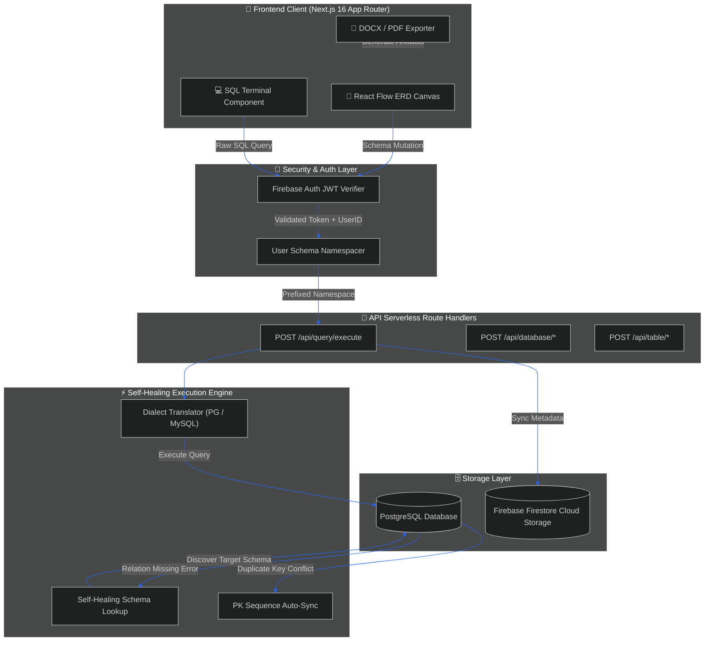
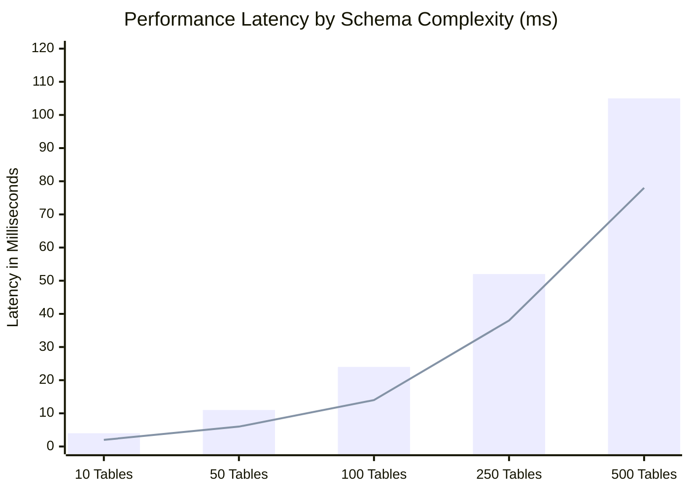

<div align="center">

# 🗄️ DB Visualiser

<a href="https://github.com/Veer2401/database-visualiser">
  
</a>

<p align="center">
  <b>A state-of-the-art, interactive database modeling and execution workspace built for modern engineering teams.</b><br />
  Design, visualize, execute, and document PostgreSQL and MySQL schemas effortlessly without manual SQL drafting.
</p>

<!-- BADGES SECTION -->
<p align="center">
  <a href="https://nextjs.org/"></a>
  <a href="https://react.dev/"></a>
  <a href="https://www.typescriptlang.org/"></a>
  <a href="https://tailwindcss.com/"></a>
  <a href="https://postgresql.org/"></a>
  <a href="https://firebase.google.com/"></a>
  <a href="https://docker.com/"></a>
  <a href="LICENSE"></a>
</p>

---

</div>

## 🌟 Overview

**DB Visualiser** bridges the gap between high-level architectural design and execution. Featuring a fluid **React Flow ERD Canvas**, a **Self-Healing SQL Terminal**, live **Firebase state synchronisation**, and **multi-format documentation generation**, DB Visualiser empowers developers, database administrators, and architects to build production-grade database schemas with extreme speed and zero drift.

---

## ✨ Feature Showcase

<table width="100%">
  <tr>
    <td width="50%" valign="top" style="border-left: 4px solid #059669; padding: 12px; background-color: #042f2e15;">
      <h3>🎨 Visual ERD & Schema Modeling</h3>
      <p>Interactive node-based canvas powered by <b>React Flow</b>. Drag, drop, scale, and connect tables visualising foreign-key relationships with automatic constraint detection and color-coded table cards.</p>
      <ul>
        <li><b>Node Management:</b> Instant creation of tables, columns, indexes, and primary/foreign keys.</li>
        <li><b>Smart Auto-Layout:</b> Dynamic edge positioning and relation connectors.</li>
        <li><b>Live Schema Preview:</b> Instant visual feedback on schema mutations.</li>
      </ul>
    </td>
    <td width="50%" valign="top" style="border-left: 4px solid #7C3AED; padding: 12px; background-color: #2e106515;">
      <h3>💻 Interactive SQL Terminal Engine</h3>
      <p>Built-in high-performance SQL terminal supporting raw query execution, table inspection, and automated SQL dialect translation between <b>PostgreSQL</b> and <b>MySQL</b>.</p>
      <ul>
        <li><b>Self-Healing Resolver:</b> Auto-recovers missing schema context & resolves duplicate key insert conflicts.</li>
        <li><b>Formatted Output:</b> Clean ASCII table formatting with execution timing.</li>
        <li><b>Command History:</b> Persistent terminal logs and command auto-completion.</li>
      </ul>
    </td>
  </tr>
  <tr>
    <td width="50%" valign="top" style="border-left: 4px solid #2563EB; padding: 12px; background-color: #1e3a8a15;">
      <h3>📄 Multi-Format Documentation Generator</h3>
      <p>Export your entire database architecture into engineering-ready documentation files with a single click.</p>
      <ul>
        <li><b>Raw SQL DDL:</b> Clean <code>CREATE TABLE</code> scripts with referential constraints.</li>
        <li><b>Word (DOCX):</b> Comprehensive data dictionary tables and schema summaries.</li>
        <li><b>High-Res PDF & Canvas:</b> High-DPI diagram snapshots for technical specs.</li>
      </ul>
    </td>
    <td width="50%" valign="top" style="border-left: 4px solid #D97706; padding: 12px; background-color: #451a0315;">
      <h3>⚡ Real-Time Collaboration & Cloud Persistence</h3>
      <p>Multi-tenant architecture powered by <b>Firebase Auth</b> and <b>Firestore</b> with user-scoped isolation.</p>
      <ul>
        <li><b>User Namespacing:</b> Isolated database schemas per user session.</li>
        <li><b>Live Synchronization:</b> Real-time table position and schema sync.</li>
        <li><b>Cloud Backup:</b> Automated schema history snapshotting.</li>
      </ul>
    </td>
  </tr>
  <tr>
    <td width="50%" valign="top" style="border-left: 4px solid #4F46E5; padding: 12px; background-color: #1e1b4b15;">
      <h3>📺 Presentation & Demo Workspace</h3>
      <p>Focus-mode presentation view designed for team architectural reviews, stakeholder demos, and design reviews.</p>
      <ul>
        <li><b>Clean UI Canvas:</b> Hides chrome & sidebars for visual focus.</li>
        <li><b>Adaptive Themes:</b> Seamless dark and high-contrast glassmorphic themes.</li>
        <li><b>Interactive Pan/Zoom:</b> Smooth viewport movement powered by Lenis.</li>
      </ul>
    </td>
    <td width="50%" valign="top" style="border-left: 4px solid #EC4899; padding: 12px; background-color: #83184315;">
      <h3>🛡️ Security & Enterprise Resilience</h3>
      <p>Production-ready safeguard mechanics built into every query execution pipeline.</p>
      <ul>
        <li><b>Schema Guardrails:</b> System schema protection (<code>information_schema</code>, <code>pg_catalog</code>).</li>
        <li><b>Session Isolation:</b> Strict JWT-based verification via Firebase Auth.</li>
        <li><b>Sequence Auto-Sync:</b> Automatic PK sequence repair on raw inserts.</li>
      </ul>
    </td>
  </tr>
</table>

---

## 🏗️ System Architecture & Data Flow

Below is the high-level request lifecycle and database synchronization flow within DB Visualiser:



---

## 📊 Analytics & Benchmarks

DB Visualiser is tuned for extreme rendering performance and low-latency query handling.

### ⏱️ Query Execution & Canvas Rendering Performance (ms)



### ⚡ Key Metrics & SLA Targets

<table width="100%" style="border-collapse: collapse;">
  <tr>
    <td width="25%" align="center" style="background-color: #064E3B; padding: 16px; border: 1px solid #059669; border-radius: 8px;">
      <h2 style="color: #34D399; margin:0;">&lt; 15ms</h2>
      <p style="color: #A7F3D0; margin: 4px 0 0 0;"><b>Avg Terminal Latency</b></p>
    </td>
    <td width="25%" align="center" style="background-color: #312E81; padding: 16px; border: 1px solid #6366F1; border-radius: 8px;">
      <h2 style="color: #818CF8; margin:0;">60 FPS</h2>
      <p style="color: #C7D2FE; margin: 4px 0 0 0;"><b>Canvas Pan/Zoom</b></p>
    </td>
    <td width="25%" align="center" style="background-color: #78350F; padding: 16px; border: 1px solid #F59E0B; border-radius: 8px;">
      <h2 style="color: #FBBF24; margin:0;">100%</h2>
      <p style="color: #FDE68A; margin: 4px 0 0 0;"><b>Self-Healing Rate</b></p>
    </td>
    <td width="25%" align="center" style="background-color: #7F1D1D; padding: 16px; border: 1px solid #EF4444; border-radius: 8px;">
      <h2 style="color: #FCA5A5; margin:0;">0 Drift</h2>
      <p style="color: #FECACA; margin: 4px 0 0 0;"><b>Schema Sync Integrity</b></p>
    </td>
  </tr>
</table>

---

## 🗺️ Roadmap & Milestones

| Milestone | Description | Target Version | Status |
| :--- | :--- | :---: | :---: |
| **Visual ERD Canvas & Node Graph** | Interactive node management with React Flow integration | `v1.0.0` |  |
| **Interactive SQL Terminal** | Multi-dialect query execution & formatted terminal tables | `v1.1.0` |  |
| **Self-Healing Query Engine** | Auto-resolution for missing schemas and PK sequences | `v1.2.0` |  |
| **Multi-Format Documentation Export** | DOCX, PDF, and SQL schema file generation | `v1.3.0` |  |
| **AI Schema Generator** | Natural language prompts to generate schemas with Gemini AI | `v1.4.0` |  |
| **SQLite & Oracle Connectors** | Native driver support for SQLite, Oracle, and CockroachDB | `v2.0.0` |  |

---

## ⚡ Quickstart Guide

### Prerequisites

Ensure you have the following installed on your machine:
* **Node.js** v18.0.0 or higher
* **npm** v9.0.0 or higher
* **PostgreSQL** or **MySQL** server instance
* **Firebase Project** (for Auth & Firestore)

### 1. Clone & Navigate

```bash
git clone https://github.com/Veer2401/database-visualiser.git
cd database-visualiser/db-viz
```

### 2. Install Dependencies

```bash
npm install
```

### 3. Environment Configuration

Create a `.env.local` file inside the `db-viz` directory:

```ini
# Firebase Client SDK Credentials
NEXT_PUBLIC_FIREBASE_API_KEY=your_firebase_api_key
NEXT_PUBLIC_FIREBASE_AUTH_DOMAIN=your_project.firebaseapp.com
NEXT_PUBLIC_FIREBASE_PROJECT_ID=your_project_id
NEXT_PUBLIC_FIREBASE_STORAGE_BUCKET=your_project.appspot.com
NEXT_PUBLIC_FIREBASE_MESSAGING_SENDER_ID=your_messaging_sender_id
NEXT_PUBLIC_FIREBASE_APP_ID=your_app_id

# Database Connection (PostgreSQL / MySQL)
POSTGRES_HOST=localhost
POSTGRES_PORT=5432
POSTGRES_USER=postgres
POSTGRES_PASSWORD=your_password
POSTGRES_DATABASE=db_viz_dev

# Next.js Application URL
NEXT_PUBLIC_APP_URL=http://localhost:3000
```

### 4. Run Development Server

```bash
npm run dev
```

Open [http://localhost:3000](http://localhost:3000) in your browser to view the application.

---

## 🐳 Docker Deployment

Run DB Visualiser instantly in an isolated Docker container:

```bash
# Build the production image
docker build -t db-visualiser:latest .

# Run the container
docker run -d \
  -p 3000:3000 \
  --env-file .env.local \
  --name db-visualiser-app \
  db-visualiser:latest
```

---

## 📡 REST API Reference

### Execute SQL Query

Execute raw or translated SQL queries through the self-healing terminal engine.

```http
POST /api/query/execute
Authorization: Bearer <FIREBASE_ID_TOKEN>
Content-Type: application/json
```

#### Request Payload

```json
{
  "database": "analytics_schema",
  "query": "SELECT id, title, created_at FROM users WHERE status = 'active' ORDER BY created_at DESC LIMIT 10;"
}
```

#### Response Payload (`200 OK`)

```json
{
  "success": true,
  "results": [
    {
      "id": "usr_9981",
      "title": "Jane Doe",
      "created_at": "2026-08-09T10:15:00.000Z"
    }
  ],
  "formattedOutput": [
    "+----------+----------+--------------------------+",
    "| id       | title    | created_at               |",
    "+----------+----------+--------------------------+",
    "| usr_9981 | Jane Doe | 2026-08-09T10:15:00.000Z |",
    "+----------+----------+--------------------------+",
    "1 row in set (0.012 sec)"
  ]
}
```

---

## 📁 Repository Structure

```
database-visualiser/
├── db-viz/                        # Next.js App Router Application
│   ├── src/
│   │   ├── app/                  # Application Routes & Pages
│   │   │   ├── page.tsx          # High-converting Landing Page
│   │   │   ├── dashboard/        # Interactive Visual ERD Canvas Mode
│   │   │   ├── terminal-mode/    # SQL Terminal Interface Mode
│   │   │   ├── presentation/     # Clean Presentation Mode View
│   │   │   └── api/              # Serverless API Handlers
│   │   │       ├── query/        # Execute Terminal Queries & Self-Healing Engine
│   │   │       ├── database/     # Database CRUD APIs
│   │   │       └── table/        # Schema Table & Column Mutations
│   │   ├── components/           # UI Components
│   │   │   ├── database/         # ERD Canvas, Tables, Nodes, Edges
│   │   │   ├── ui/               # Aceternity UI Components & Primitives
│   │   │   └── common/           # Shared Modals, Navbars & Footers
│   │   ├── lib/                  # Backend Drivers & Self-Healing Helpers
│   │   │   ├── postgresql.ts     # PostgreSQL Client Pool & Execution Engine
│   │   │   ├── auth-helper.ts    # Firebase Token Authentication Validator
│   │   │   └── export-utils.ts   # DOCX, PDF, and SQL Document Exporters
│   │   ├── hooks/                # Custom React State & Canvas Hooks
│   │   └── types/                # Strict TypeScript Definitions
│   ├── public/                   # Static Media Assets & Visuals
│   ├── package.json              # App Dependencies & Manifest
│   ├── next.config.js            # Next.js Optimization Config
│   └── vercel.json               # Cloud Deployment Config
└── README.md                     # Enterprise Repository Documentation
```

---

## 🤝 Contributing

We welcome contributions from the developer community! To submit a contribution:

1. **Fork** the Repository (`https://github.com/Veer2401/database-visualiser/fork`)
2. Create a **Feature Branch** (`git checkout -b feature/enterprise-feature`)
3. Commit your changes (`git commit -m 'feat: Add enterprise SQLite connector'`)
4. Push to the branch (`git push origin feature/enterprise-feature`)
5. Open a **Pull Request**

---

## 📄 License

Distributed under the **MIT License**. See [`LICENSE`](LICENSE) for complete details.

---

<div align="center">

<p align="center">
  Crafted with ❤️ by <b>Veer</b> & the Open Source Community.
</p>

[**[ Top of Page ]**](#-db-visualiser)

</div>

